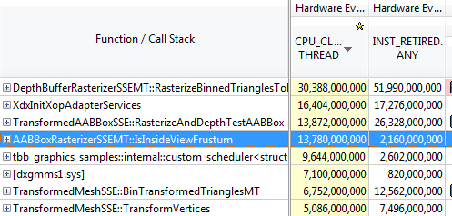
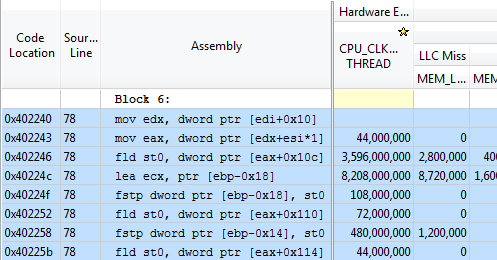
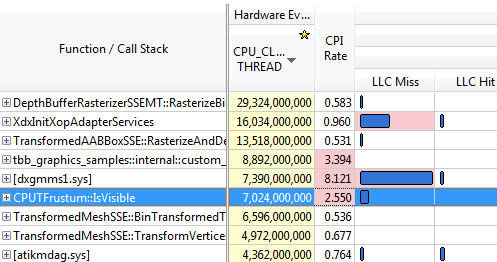

-parent=optimizing-sw-occlusion-culling-index
-title=Fixing cache issues, the lazy way
-time=2013-02-01 09:54:16

Last time, we ended on a bit of a cliffhanger. We'll continue right where we left off, but first, I want to get a few things out of the way.

First, a lot of people have been asking me what profiler I've been using for the various screenshots. So, for the record, the answer is that all these measurements were done using the current version of Intel VTune. VTune has a bit of a learning curve, and if I just want to quickly figure out why something is slow I prefer other tools. But if you're trying to figure out what's really going on while your code is running, you want something that supports the CPU's internal event\-based sampling counters and can do the proper analysis, and VTune does. If on the other hand you just want to take a quick peek to figure out why something is slow \(which is most of the time while you're not fine\-tuning\), I suggest you start with [Very Sleepy](http://www.codersnotes.com/sleepy) \- it's free, small and easy to use.

Next, some background on why I'm writing this: I do not intend to badmouth the sample project I've been using for this series, nor do I want to suggest it's doing anything particularly stupid. As you might have noticed, both the write\-combining issues and the involuntary sharing we saw last post boiled down to two\-line fixes in the source. These kinds of things just happen as code gets written and modified, particularly if there's deadlines involved. In fact, I'm using this example precisely because the problems I've found in it are so very typical: I have run into all of these problems before on other projects, and I assume so have most engine programmers who've shipped a game. That's exactly why I think this is worth writing down: so that people who don't have much optimization experience and are running into performance problems know what to look for.

Third, lest you get a false impression: I'm in a comfortable position here \- I spent two weekends \(and the equivalent of maybe 3 days worth of full\-time work\) looking at the code, profiling and tweaking it. And of course, I'm only writing up the changes that worked. You don't get to see the false starts and all the ideas that didn't pan out. Nor am I presenting my changes in chronological order: as you can see in the [Github repository](https://github.com/rygorous/intel_occlusion_cull/commits/dev), in fact I did the SSE version of `CPUTFrustum::IsVisible` a whole day before I found the sharing issues that were the actual bottleneck. With 20\-20 hindsight, I get to present changes in order of impact, but that's not how it plays out in practice. The whole process is a lot messier \(and less deterministic\) than it may seem in these posts.

And with all that out of the way, let's look at cache effects.

### Previously...

...we looked at the frustum culling code in [Intel's Software Occlusion Culling sample](http://software.intel.com/en-us/vcsource/samples/software-occlusion-culling). The last blog post ended with me showing this profile:



and explaining that the actual issue is triggered by this \(inlined\) function:

```
void TransformedAABBoxSSE::IsInsideViewFrustum(CPUTCamera *pCamera)
{
    float3 mBBCenterWS;
    float3 mBBHalfWS;
    mpCPUTModel->GetBoundsWorldSpace(&mBBCenterWS, &mBBHalfWS);
    mInsideViewFrustum = pCamera->mFrustum.IsVisible(mBBCenterWS,
        mBBHalfWS);
}
```

which spends a considerable amount of time missing the cache while trying to read the world\-space bounding box from `mpCPUTModel`. Well, I didn't actually back that up with any data yet. As you can see in the above profile, we spend about 13.8 billion cycles total in `AABBoxRasterizerSSEMT::IsInsideViewFrustum` in the profile. Now, if you look at the actual assembly code, you'll notice that a majority of them are actually spent in a handful of instructions:



As you can see, about 11.7 of our 13.8 billion cycles are get counted on a mere two instructions. The column right next to the cycle counts is the number of "last\-level cache" \(L3 cache\) misses. It doesn't take a genius to figure out that we might be running into cache issues here.

The code you're seeing is inlined from `CPUTModel::GetBoundsWorldSpace`, and simply copies the 6 floats describing the bounding box center and half\-extents from the model into the two provided locations. That's all this fragment of code does. Well, the member variables of `CPUTModel` are one indirection through `mpCPUModelT` away, and clearly, following that pointer seems to result in a lot of cache misses. In turns out that this is the only time anyone ever looks at data from `CPUTModel` during the frustum\-culling pass. Now, what we really want is the 24 bytes worth of bounding box that we're going to read. But CPU cores fetch data in units of cache lines, which is 64 bytes on current x86 processors. So best case, we're going to get 24 bytes worth of data that we care about, and 40 bytes of data that we don't. If we're unlucky and the box crosses a cache line boundary, we might even end up fetching 128 bytes. And because it's behind some arbitrary pointer, the processor can't easily do tricks like automated memory prefetching that reduce the cost of memory accesses: prefetching requires predictable access patterns, and following pointers isn't very predictable \- not to the CPU core, anyway.

At this point, you might decide to rewrite the whole thing to have more coherent access patterns. Now the frustum culling loop actually isn't that complicated, and rewriting it \(and changing the data structures to be more cache\-friendly\) wouldn't take very long, but for new let's suppose we don't know that. Is there any way incremental, less error\-prone way to give us a quick speed boost, and maybe get us in a better position should we choose to change the frustum culling code later?

### Making those prefetchers work

Of course there is, or I wouldn't be asking. The key realization is that the outer loop in `AABBoxRasterizerSSEMT::IsInsideViewFrustum` actually traverses an array of bounding boxes \(type `TransformedAABBoxSSE`\) in order:

```
for(UINT i = start; i < end; i++)
{
    mpTransformedAABBox[i].IsInsideViewFrustum(mpCamera);
}
```

One linear traversal is all we need. We know that the hardware prefetcher is going to load that ahead for us \- and by now, they're smart enough to do that properly even if our accesses are strided, that is, we don't read all the data between the start and the end of the array, but only some of them with a regular spacing. This means that if we can get those world\-space bounding boxes into `TransformedAABBoxSSE`, they'll automatically get prefetched for us. And it turns out that in this example, all models are at a fixed position \- we can determine the world\-space bounding boxes once, at load time. Let's look at our function again:

```
void TransformedAABBoxSSE::IsInsideViewFrustum(CPUTCamera *pCamera)
{
    float3 mBBCenterWS;
    float3 mBBHalfWS;
    mpCPUTModel->GetBoundsWorldSpace(&mBBCenterWS, &mBBHalfWS);
    mInsideViewFrustum = pCamera->mFrustum.IsVisible(mBBCenterWS,
        mBBHalfWS);
}
```

Here's the punch line: all we really have to do is promote these two variables from locals to member variables, and move the `GetBoundsWorldSpace` call to init time. Sure, it's a bit crude, and it leads to data duplication, but on the plus side, this is a really easy thing to try \- just move a few lines of code around. If it pans out, we can always do it cleaner later. Which leaves the question \- *does* it pan out?



Of course it does \- I get to cheat and only write about the changes that work, remember? As you see, now the clock cycles are back in `CPUTFrustum::IsVisible`. This is not because it's gotten mysteriously slower, it's because `IsInsideViewFrustum` doesn't copy any data anymore, so `IsVisible` is the first function to look at the bounding box cache lines now. Which means that it gets billed for those cache misses now.

It's still not great \(I've included the Clocks Per Instruction Rate again so we can see where we stand\), but we're clearly making progress: compared to the first profile at the top of this post, which has a similar total cycle count, we're very roughly twice as fast \- and that's for `IsVisible`, which includes not just the cache misses but also the actual frustum culling work. Meanwhile, `AABBoxRasterizerSSEMT::IsInsideViewFrustum`, now really just a loop, has dropped well out of the top 20 hot spots, as it should. Pretty good for just moving a couple of lines of code around.

### Order in the cache!

Okay, our quick fix got the HW prefetchers to work for us, and clearly that gave us a considerable improvement. But we still only need 24 bytes out of every `TransfomedAABBoxSSE`. How big are they? Let's have a look at the data members \(methods elided\):

```
class TransformedAABBoxSSE
{
    // Methods elided

    CPUTModelDX11 *mpCPUTModel;
    __m128 *mWorldMatrix;
    __m128 *mpBBVertexList;
    __m128 *mpXformedPos;
    __m128 *mCumulativeMatrix; 
    UINT    mBBIndexList[AABB_INDICES]; /* 36 */
    bool   *mVisible;
    bool    mInsideViewFrustum;
    float   mOccludeeSizeThreshold;
    bool    mTooSmall;
    __m128 *mViewPortMatrix; 

    float3 mBBCenter;
    float3 mBBHalf;
    float3 mBBCenterWS;
    float3 mBBHalfWS;
};
```

In a 32\-bit environment, that gives us 226 bytes of payload per BBox \(the actual size is a bit more, due to alignment padding\). Of these 226 bytes, for the frustum culling, we actually read 24 bytes \(`mBBCenterWS` and `mBBHalfWS`\) and write one \(`mInsideViewFrustum`\). That's a pretty bad ratio, and there's a lot of memory wasting going on, but for the purposes of caching, we only pay for what we actually read, and that's not much. That said, even though we don't access it here, the biggest chunk of data in the whole thing is `mBBIndexList` at 144 bytes, which is just a list of triangle indices for this BBox. That's completely unnecessary, since that list is going to be the same for every single BBox in the system. So let's fix that one and reorder some of the other fields so that the members we're going to access during frustum culling are close by each other \(and hence more likely to hit the same cache line\):

```
class TransformedAABBoxSSE
{
    // Methods elided

    CPUTModelDX11 *mpCPUTModel;
    __m128 *mWorldMatrix;
    __m128 *mpBBVertexList;
    __m128 *mpXformedPos;
    __m128 *mCumulativeMatrix; 
    bool   *mVisible;
    float   mOccludeeSizeThreshold;
    __m128 *mViewPortMatrix; 

    float3 mBBCenter;
    float3 mBBHalf;
    bool   mInsideViewFrustum;
    bool   mTooSmall;
    float3 mBBCenterWS;
    float3 mBBHalfWS;
};
```

Note that we're writing `mInsideViewFrustum` right after we read the bounding boxes, so it makes sense to make them adjacent. I put the fields between the object\-space and the world\-space bounding box simply because the object\-space bounding box is reasonably large \(24 bytes, about a third of a cache line\) and having it between the flags and the box greatly increases our chance of having to fetch two cache lines not one per box.

So, did it help?


Sure did. `IsVisible` is down to the number 10 spot, and the CPI Rate is down to an acceptable 1.042 clocks/instruction. Now that's by no means the end of the line, but I want to make this clear: all I did here was factor out one common array to be a shared `static const` variable, and reorder some class members. That's it. If you don't count the initializers for the 36\-element index list \(which I've copied with comments and generous spacing, so it's a few lines long\), we're talking less than 10 lines of code changed for all the improvements in this post. Total.

In the last few years, there's been a push by several prominent game developers to "Data\-Oriented Design", which emphasizes structuring code around desired data\-flow patterns, rather than the other way round. That's a sound design strategy particularly for subsystems like the one we're looking at. It's also a good guideline for what you want to work *towards* when refactoring existing code. But the point I want to make here is that even when trying to optimize existing code within its existing environment, you can achieve substantial gains by a sequence of simple, localized improvements. That will only get you so far, but there's a lot to be said for incremental techniques, especially if you're just trying to hit a given performance goal in a limited time budget.

And that's it for today. I might do another post on the frustum culling \(I want it gone from the top 10 completely!\), or I might turn to the actual rasterizer code next for a change of pace \- haven't decided yet. Until next time!
