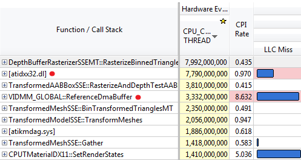
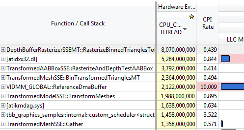

-title=Mopping up
-time=2013-03-05 10:10:59
*This post is part of a series \- go [here](*optimizing-sw-occlusion-culling-index) for the index.*

Welcome back! This post is going to be slightly different from the others. So far, I've attempted to group the material thematically, so that each post has a coherent theme \(to a first\-order approximation, anyway\). Well, this one doesn't \- this is a collection of everything that didn't fit anywhere else. But don't worry, there's still some good stuff in here! That said, one warning: there's a bunch of poking around in the framework code this time, and it didn't come with docs, so I'm honestly not quite sure how some of the internals are supposed to work. So the code changes referenced this time are definitely on the hacky side of things.

### The elephant in the room

Featured quite near the top of all the profiles we've seen so far are two functions I haven't talked about before:



In case you're wondering, the `VIDMM_Global::ReferenceDmaBuffer` is what used to be just "`[dxgmms1.sys]`" in the previous posts; I've set up VTune to use the symbol server to get debug symbols for this DLL. Now, I haven't talked about this code before because it's part of the GPU rendering, not the software rasterizer, but let's broaden our scope one final time.

What you can see here is the video memory manager going over the list of resources \(vertex/index buffers, constant buffers, textures, and so forth\) referenced by a DMA buffer \(which is what WDDM calls GPU command buffers in the native format\) and *completely* blowing out the cache; each resource has some amount of associated metadata that the memory manager needs to look at \(and possibly update\), and it turns out there's *many* of them. The cache is not amused.

So, what can we do to use less resources? There's lots of options, but one thing I had noticed while measuring loading time is that there's one dynamic constant buffer per model:

```
// Create the model constant buffer.
HRESULT hr;
D3D11_BUFFER_DESC bd = {0};
bd.ByteWidth = sizeof(CPUTModelConstantBuffer);
bd.BindFlags = D3D11_BIND_CONSTANT_BUFFER;
bd.Usage = D3D11_USAGE_DYNAMIC;
bd.CPUAccessFlags = D3D11_CPU_ACCESS_WRITE;
hr = (CPUT_DX11::GetDevice())->CreateBuffer( &bd, NULL,
    &mpModelConstantBuffer );
ASSERT( !FAILED( hr ), _L("Error creating constant buffer.") );
```

Note that they're all the same size, and it turns out that all of them get updated \(using a `Map` with `DISCARD`\) immediately before they get used for rendering. And because there's about 27000 models in this example, we're talking about a lot of constant buffers here.

What if we instead just created one dynamic model constant buffer, and shared it between all the models? It's a fairly simple change to make, if you're willing to do it in a hacky fashion \(as said, not very clean code this time\). For this test, I took the liberty of adding some timing around the actual D3D rendering code as well, so we can compare. It's probably gonna make a difference, but how much can it be, really?

**Change:** Single shared dynamic model constant buffer
<br><table>
  <tbody><tr>
    <th>Render scene</th>
    <th>min</th><th>25th</th><th>med</th><th>75th</th><th>max</th><th>mean</th><th>sdev</th>
  </tr>
  <tr>
    <td>Original</td>
    <td>3.392</td><td>3.501</td><td>3.551</td><td>3.618</td><td>4.155</td><td>3.586</td><td>0.137</td>
  </tr>
  <tr>
    <td>One dynamic CB</td>
    <td>2.474</td><td>2.562</td><td>2.600</td><td>2.644</td><td>3.043</td><td>2.609</td><td>0.068</td>
  </tr>
</tbody></table>

It turns out that reducing the number of distinct constant buffers referenced per frame by several thousand is a pretty big deal. Drivers work hard to make constant buffer `DISCARD` really, really fast, and they make sure that the underlying allocations get handled quickly. And discarding a single constant buffer a thousand times in a frame works out to be a lot faster than discarding a thousand constant buffers once each.

Lesson learned: for "throwaway" constant buffers, it's a good idea to design your renderer so it only allocates one underlying D3D constant buffer per size class. More are not necessary and can \(evidently\) induce a substantial amount of overhead. D3D11.1 adds a few features that allow you to further reduce that count down to a single constant buffer that's used the same way that dynamic vertex/index buffers are; as you can see, there's a reason. Here's the profile after this single fix:



Still a lot of time spent in the driver and the video memory manager, but if you compare the raw cycle counts with the previous image, you can see that this change really made quite a dent.

### Loading time

This was \(for the most part\) something I worked on just to make my life easier \- as you can imagine, while writing this series, I've recorded lots of profiling and tests runs, and the loading time is a fixed cost I pay every time. I won't go in depth here, but I still want to give a brief summary of the changes I made and why. If you want to follow along, the changes in the source code start at the "[Track loading time](https://github.com/rygorous/intel_occlusion_cull/commit/5d4f83887034761c47bdd03ff4c834d7f24adc59)" commit.

#### Initial: 9.29s

First, I simply added a timer and code to print the loading time to the debug output window.

#### Load materials once, not once per model: 4.54s

One thing I noticed way back in January when I did my initial testing was that most materials seem to get loaded multiple times; there seems to be logic in the asset library code to avoid loading materials multiple times, but it didn't appear to work for me. So I modified the code to actually load each material only once and then create copies when requested. As you can see, [this change](https://github.com/rygorous/intel_occlusion_cull/commit/b4e29b2dfb43a040a9eb5ed5c074092766fe4ba7) by itself roughly cut loading times in half.

#### FindAsset optimizations: 4.32s

`FindAsset` is the function used in the asset manager to actually look up resources by name. With two simples changes to avoid unnecessary [path name resolution](https://github.com/rygorous/intel_occlusion_cull/commit/0b25f7de67f2631ac09456679f4857e86fdd5566) and [string compares](https://github.com/rygorous/intel_occlusion_cull/commit/40bde879d627ff4e129624a7230255656087f21a), the loading time loses another 200ms.

#### Better config file loading: 2.54s

I mentioned this in "[A string processing rant](*a-string-processing-rant)", but didn't actually merge the changes into the blog branch so far. Well, here you go: with [these](https://github.com/rygorous/intel_occlusion_cull/commit/9b7648b1a1ba5b7c8e419645a2878491f36faa4e) [three](https://github.com/rygorous/intel_occlusion_cull/commit/b5a62433664f5480ede40ab8f1945f3bb999e919) [commits](https://github.com/rygorous/intel_occlusion_cull/commit/574e48e49ba09399420f43244576d8dbf50d4391) that together rewrite a substantial portion of the config file reading, we lose almost another 2 seconds. Yes, that was *2 whole seconds* worth of unnecessary allocations and horribly inefficient string handling. I wrote that rant for a reason.

#### Improve shader input layout cache: 2.03s

D3D11 wants shader input layouts to be created with a pointer to the bytecode of the shader it's going to be used with, to handle vertex format to shader binding. The "shader input layout cache" is just an internal cache to produce such input layouts for all unique combinations of vertex formats and shaders we use. The original implementation of this cache was fairly inefficient, but the code already contained a "TODO" comment with instructions of how to fix it. In [this commit](https://github.com/rygorous/intel_occlusion_cull/commit/b10993347b5ff983306f644dafd636961f266e47), I implemented that fix.

#### Reduce temporary strings: 1.88s

There were still a bunch of unnecessary string temporaries being created, which I found simply by looking at the call stack profiles of `free` calls during the loading phase \(yet another useful application for profilers\)! [Two](https://github.com/rygorous/intel_occlusion_cull/commit/bbbfb89a304c14617e58cb2cf1e0fa16bfe322a8) [commits](https://github.com/rygorous/intel_occlusion_cull/commit/beb92aaefdfe1a06f2c0daa87627fcf550078488) later, this problem was resolved too.

#### Actually share materials: 1.46s

Finally, [this commit](https://github.com/rygorous/intel_occlusion_cull/commit/464503ca5bd657d7d6c6dc9e8a9144e1f223a278) goes one step further than just loading the materials once, it also actually shares the same material instance between all its users \(the previous version created copies\). *This is not necessarily a safe change to make*. I have no idea what invariants the asset manager tries to enforce, if any. Certainly, this would cause problems if someone were to start modifying materials after loading \- you'd need to introduce copy\-on\-write or something similar. But in our case \(i.e. the Software Occlusion Culling demo\), the materials do not get modified after loading, and sharing them is completely safe.

Not only does this reduce loading time by another 400ms, it also makes rendering a lot faster, because suddenly there's a lot less cache misses when setting up shaders and render states for the individual models:

**Change:** Share materials.
<br><table>
  <tbody><tr>
    <th>Render scene</th>
    <th>min</th><th>25th</th><th>med</th><th>75th</th><th>max</th><th>mean</th><th>sdev</th>
  </tr>
  <tr>
    <td>Original</td>
    <td>3.392</td><td>3.501</td><td>3.551</td><td>3.618</td><td>4.155</td><td>3.586</td><td>0.137</td>
  </tr>
  <tr>
    <td>One dynamic CB</td>
    <td>2.474</td><td>2.562</td><td>2.600</td><td>2.644</td><td>3.043</td><td>2.609</td><td>0.068</td>
  </tr>
  <tr>
    <td>Share materials</td>
    <td>1.870</td><td>1.922</td><td>1.938</td><td>1.964</td><td>2.331</td><td>1.954</td><td>0.057</td>
  </tr>
</tbody></table>

Again, this is somewhat extreme because there's so many different models around, but it illustrates the point: you really want to make sure there's no unnecessary duplication of data used during rendering; you're going to be missing the cache enough during regular rendering as it is.

And at that point, I decided that I could live with 1.5 seconds of loading time, so I didn't pursue the matter any further. :\)

### The final rendering tweak

There's one more function with a high number of cache misses in the profiles I've been running, even though it's never been at the top. That function is `AABBoxRasterizerSSE::RenderVisible`, which uses the \(post\-occlusion\-test\) visibility information to render all visible models. Here's the code:

```
void AABBoxRasterizerSSE::RenderVisible(CPUTAssetSet **pAssetSet,
    CPUTRenderParametersDX &renderParams,
    UINT numAssetSets)
{
    int count = 0;

    for(UINT assetId = 0, modelId = 0; assetId < numAssetSets; assetId++)
    {
        for(UINT nodeId = 0; nodeId < GetAssetCount(); nodeId++)
        {
            CPUTRenderNode* pRenderNode = NULL;
            CPUTResult result = pAssetSet[assetId]->GetAssetByIndex(nodeId, &pRenderNode);
            ASSERT((CPUT_SUCCESS == result), _L ("Failed getting asset by index")); 
            if(pRenderNode->IsModel())
            {
                if(mpVisible[modelId])
                {
                    CPUTModelDX11* model = (CPUTModelDX11*)pRenderNode;
                    model = (CPUTModelDX11*)pRenderNode;
                    model->Render(renderParams);
                    count++;
                }
                modelId++;                      
            }
            pRenderNode->Release();
        }
    }
    mNumCulled =  mNumModels - count;
}
```

This code first enumerates all `RenderNodes` \(a base class\) in the active asset libraries, ask each of them "are you a model?", and if so renders it. This is a construct that I've seen several times before \- but from a performance standpoint, this is a *terrible* idea. We walk over the whole scene database, do a virtual function call \(which means we have, at the very least, load the cache line containing the vtable pointer\) to check if the current item is a model, and only then check if it is culled \- in which case we just ignore it.

That is a stupid game and we should stop playing it.

Luckily, it's easy to fix: at load time, we traverse the scene database *once*, to make a list of all the models. Note the code already does such a pass to initialize the bounding boxes etc. for the occlusion culling pass; all we have to do is set an extra array that maps `modelId`s to the corresponding models. Then the actual rendering code turns into:

```
void AABBoxRasterizerSSE::RenderVisible(CPUTAssetSet **pAssetSet,
    CPUTRenderParametersDX &renderParams,
    UINT numAssetSets)
{
    int count = 0;

    for(modelId = 0; modelId < mNumModels; modelId++)
    {
        if(mpVisible[modelId])
        {
            mpModels[modelId]->Render(renderParams);
            count++;
        }
    }

    mNumCulled =  mNumModels - count;
}
```

That already looks much better. But how much does it help?

**Change:** Cull before accessing models
<br><table>
  <tbody><tr>
    <th>Render scene</th>
    <th>min</th><th>25th</th><th>med</th><th>75th</th><th>max</th><th>mean</th><th>sdev</th>
  </tr>
  <tr>
    <td>Original</td>
    <td>3.392</td><td>3.501</td><td>3.551</td><td>3.618</td><td>4.155</td><td>3.586</td><td>0.137</td>
  </tr>
  <tr>
    <td>One dynamic CB</td>
    <td>2.474</td><td>2.562</td><td>2.600</td><td>2.644</td><td>3.043</td><td>2.609</td><td>0.068</td>
  </tr>
  <tr>
    <td>Share materials</td>
    <td>1.870</td><td>1.922</td><td>1.938</td><td>1.964</td><td>2.331</td><td>1.954</td><td>0.057</td>
  </tr>
  <tr>
    <td>Fix RenderVisible</td>
    <td>1.321</td><td>1.358</td><td>1.371</td><td>1.406</td><td>1.731</td><td>1.388</td><td>0.047</td>
  </tr>
</tbody></table>

I rest my case.

And I figure that this nice 2.59x cumulative speedup on the rendering code is a good stopping point for the coding part of this series \- quit while you're ahead and all that. There's a few more minor fixes \(both for actual bugs and speed problems\) on [Github](https://github.com/rygorous/intel_occlusion_cull/commits/blog), but it's all fairly small change, so I won't go into the details.

This series is not yet over, though; we've covered a lot of ground, and every case study should spend some time reflecting on the lessons learned. I also want to explain why I covered what I did, what I left out, and a few notes on the way I tend to approach performance problems. So all that will be in the next and final post of this series. Until then!